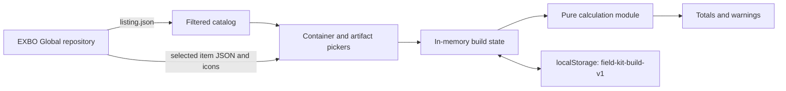

# Architecture

## Product boundary

The current application is a manual artifact loadout calculator. A user selects
one backpack or container, fills the capacity-derived slots with artifacts,
configures each artifact, and receives live combined totals and exposure
warnings. Armor, consumable buffs, accounts, remote build storage, comparisons,
and artifact optimization are outside the implemented product boundary.

The application is a React single-page app built by Vite. The active entry point
is [`src/main.tsx`](../src/main.tsx), and
[`src/App.tsx`](../src/App.tsx) owns the screen flow and application state.

## Runtime flow

At startup, [`loadCatalog`](../src/data.ts) fetches the Global
`listing.json`, keeps base artifact entries plus `containers` and `backpacks`,
and sorts them by English name. Item JSON is fetched only after selection. Images
use the icon paths from the same listing. Both data and images are requested
directly from `raw.githubusercontent.com`; runtime use therefore requires the
browser to reach GitHub.

## Source ownership

- [`src/data.ts`](../src/data.ts) is the EXBO adapter. It owns repository URLs,
  catalog filtering, recursive numeric/range extraction, translation fallback,
  and conversion from raw item data to calculator stats and container fields.
- [`src/types.ts`](../src/types.ts) defines the boundary between raw EXBO data,
  configured artifacts, persisted builds, and calculated totals.
- [`src/calculations.ts`](../src/calculations.ts) is the pure domain layer. UI or
  optimizer work should call this layer instead of duplicating formulas.
- [`src/App.tsx`](../src/App.tsx) owns item selection, slot management, artifact
  editing, error presentation, persistence, and responsive screen composition.
- [`src/styles.css`](../src/styles.css) owns visual layout and the desktop,
  tablet, mobile, and reduced-motion presentation.

## EXBO contract

Only the Global realm is loaded. Item IDs and listing paths are treated as opaque
EXBO values. Stat identity comes from translation keys beginning with
`stalker.artefact_properties.factor.` rather than displayed names. Green/red
`formatted.valueColor` values classify a raw stat as beneficial or harmful, and
the English formatted value determines whether the UI appends `%`. These are
adapter assumptions: changes in EXBO's JSON structure should be handled and
tested in [`src/data.ts`](../src/data.ts), not scattered through the UI.

The project does not redistribute EXBO item files. Attribution and the upstream
license notice are recorded in [`NOTICE`](../NOTICE) and
[`LICENSE`](../LICENSE).

## State and persistence

The selected container and configured artifact array are held in React state.
Changing to a smaller container truncates artifacts beyond its capacity. Copying
an artifact targets the first empty slot. Decreasing artifact level removes bonus
entries beyond the new `+5`, `+10`, and `+15` unlock count.

Every container or artifact change writes a versioned `PersistedBuild` to
`localStorage` under `field-kit-build-v1`. Startup accepts only persistence
version `1`; invalid JSON or other versions are ignored. The saved record includes
the selected raw item data and parsed stats, allowing an existing build to render
when catalog loading fails. Reset clears both state and the storage key.

Generated UI IDs prefer `crypto.randomUUID()` and fall back to a timestamp plus
`Math.random()` when that Web Crypto helper is unavailable. These IDs only
identify local artifact and bonus rows; they are not credentials or security
tokens.

## Failure and privacy boundaries

Catalog-loading errors and selected-item errors are separate UI states. A catalog
failure disables new selection but does not delete a saved build. A selected-item
failure names the item and surfaces the underlying exception. There is no retry,
offline catalog cache, schema validator, or upstream-version pin at present.

No build data is sent to an application backend. Build configuration stays in
the user's browser, while normal HTTP request metadata is visible to GitHub when
the browser loads EXBO JSON and icons. The code contains no runtime secrets.

## Optimizer boundary

The planned optimizer is not implemented. It should consume the parsed catalog
types and pure calculations rather than introduce a second EXBO parser or formula
set. Search objectives and constraints should remain separate from manual build
state so the current calculator stays usable without running an exhaustive
search.
