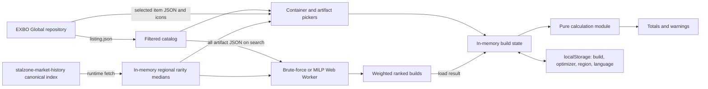

# Architecture

## Product boundary

The application supports manual artifact loadouts and theoretical catalog
optimization. A user selects one backpack or container, then either configures
the capacity-derived slots directly or searches catalog combinations
under shared artifact assumptions and weighted objectives. Armor, consumable
buffs, accounts, remote build storage, owned-artifact inventory, and comparisons
remain outside the implemented product boundary.

The primary workspace switches between Build optimizer and Build calculator,
with the optimizer selected on every page load. Both modes expose the same
carrier selector and edit the same in-memory carrier state. In the optimizer,
carrier selection is the first section of the left filter column; the results
column remains visible with a selection prompt before a carrier is chosen.
Loading an optimizer result switches to the calculator so the generated
artifacts can be inspected and adjusted immediately.

Ranked optimizer builds use one full-width card per row. Within each card, enabled
search objectives remain in configured order with normalization evidence in the
left effects column. Every remaining non-zero build effect appears in the right
column under the same Mobility, Survivability, Protection, Exposure, and Other
effects categories as the manual calculator. The columns stack on narrow screens.

The application is a React/Vite single-page app. [`src/main.tsx`](../src/main.tsx)
initializes i18next; [`src/App.tsx`](../src/App.tsx) owns screen flow and state.
The production site is a static GitHub Pages deployment at
`https://mzmrk.github.io/stalzone-field-kit/`; it has no application server.

## Runtime flow

At startup, [`loadCatalog`](../src/data.ts) fetches the Global
`listing.json`, keeps base artifact entries plus `containers` and `backpacks`,
and sorts them by English name. UI names use the active EXBO English or Russian
translation. Manual item JSON is fetched after selection; the
first optimizer run loads every artifact JSON with up to ten concurrent requests
and retains parsed data in memory for later searches. Images use the icon paths
from the same listing. Both data and images are requested directly from
`raw.githubusercontent.com`; runtime use therefore requires the browser to reach
GitHub.

Pricing is fetched at runtime directly from the canonical index committed by
the separately maintained `stalzone-market-history` repository, which owns
auction acquisition and price estimation. This application validates the
response and keeps it only in memory; it contains no bundled price data, cache,
or fallback. Concurrent consumers share one request, and the validated result is
reused for the lifetime of the page.
[`src/pricing.ts`](../src/pricing.ts) selects
EU, RU, NA, SEA, or NEA from one generated bundle; EU is the persisted default.
Direct completed-sale prices are lime, adjacent-rarity estimates amber, and
unknowns gray. Source details include samples, method, date, and region. Unknown
tiers are excluded by an active price cap. Raw caches are not shipped.

## Source ownership

- [`src/data.ts`](../src/data.ts) is the EXBO adapter. It owns repository URLs,
  catalog filtering, recursive numeric/range extraction, translation fallback,
  and conversion from raw item data to calculator stats and container fields.
- [`src/types.ts`](../src/types.ts) defines the boundary between raw EXBO data,
  configured artifacts, persisted builds, and calculated totals.
- [`src/calculations.ts`](../src/calculations.ts) is the pure domain layer. UI or
  optimizer work should call this layer instead of duplicating formulas.
- [`src/optimizer.ts`](../src/optimizer.ts) owns canonical-combination counts,
  exact enumeration, objective best-value discovery, and top-ten weighted
  ranking.
- [`src/optimizer.worker.ts`](../src/optimizer.worker.ts) runs that synchronous
  search away from the UI thread and reports progress and results.
- [`src/milp-optimizer.ts`](../src/milp-optimizer.ts) expresses the same artifact
  choices and constraints as a mixed-integer linear program, derives the best
  possible value for each objective, and returns up to ten bounded ranked builds.
  [`src/highs-solver.ts`](../src/highs-solver.ts) adapts the persistent HiGHS API
  and retains feasibility, bound, and gap diagnostics.
  [`src/milp-optimizer.worker.ts`](../src/milp-optimizer.worker.ts)
  loads the WebAssembly solver away from the UI thread and streams each ranked
  build before the remaining ranks finish.
- [`src/pricing.ts`](../src/pricing.ts) maps EXBO artifact IDs and rarity indices
  to the validated in-memory market estimates and owns ruble display formatting.
  Its algorithm and source history are owned by `stalzone-market-history`.
- [`src/app-errors.ts`](../src/app-errors.ts) owns stable optimizer and pricing
  failure codes and their player-facing message keys. Worker diagnostics remain
  technical data rather than UI copy.
- [`src/i18n.ts`](../src/i18n.ts) owns EN/RU selection and locale helpers;
  [`src/locales/`](../src/locales/) owns UI translations.
- [`src/App.tsx`](../src/App.tsx) owns item selection, slot management, artifact
  editing, optimizer controls and live-data loading, result application, error
  presentation, persistence, and responsive screen composition.
- [`src/styles.css`](../src/styles.css) owns visual layout and the desktop,
  tablet, mobile, and reduced-motion presentation.

## EXBO contract

Only the Global realm is loaded. Item IDs and listing paths are treated as opaque
EXBO values. Stat identity comes from translation keys beginning with
`stalker.artefact_properties.factor.` rather than displayed names. Green/red
`formatted.valueColor` values classify a raw stat as beneficial or harmful, and
the English formatted value determines whether the UI appends `%`. These are
adapter assumptions: changes in EXBO's JSON structure should be handled and
tested in [`src/data.ts`](../src/data.ts), not scattered through the UI.

The project source code is released under the MIT License in
[`LICENSE`](../LICENSE). It does not redistribute EXBO item files; attribution
and the upstream database license are recorded separately in
[`NOTICE`](../NOTICE).

## State and persistence

The selected container and configured artifact array are held in React state.
Changing to a smaller container truncates artifacts beyond its capacity. Copying
an artifact targets the first empty slot. Decreasing artifact level removes bonus
entries beyond the new `+5`, `+10`, and `+15` unlock count.

Build changes write versioned state to `field-kit-build-v1`. Startup accepts only
version `1`; malformed or other versions are ignored. Raw item data lets a saved
build render when catalog loading fails. Reset clears state and storage.

Optimizer controls are stored separately under `field-kit-optimizer-v1`: shared
level, enabled rarities, positive objectives and minimums, harmful policies and
limits, and the price cap. Loading merges saved rows by stat key with the current
supported lists and falls back field-by-field when stored data is invalid, so a
catalog/UI update does not require an all-or-nothing settings migration. Reset
filters restores the current defaults and cancels an active optimizer run without
changing the manual carrier or artifacts.

Language is stored under `field-kit-language-v1`. An explicit choice wins;
otherwise any `ru` browser preference selects Russian and English is the fallback.
Switching language is immediate and does not recreate the build. Official EXBO
item translations and locale-aware number, ruble, and date formatting follow it.
The active optimizer/calculator workspace is intentionally transient rather than
persisted; opening or refreshing the application starts on the optimizer.

## Failure and privacy boundaries

Catalog-loading, price-index, and selected-item errors are separate UI states. A catalog
failure disables new selection but does not delete a saved build. A selected-item
failure names the item and surfaces the underlying exception. There is no retry,
offline catalog cache or upstream-version pin at present. A failed or invalid
price-index request leaves prices unavailable and disables a configured
price-capped search; no previous or bundled price data is substituted.
Pricing distinguishes download failures from invalid index data. Optimizer
workers return stable failure codes plus technical diagnostics; the UI localizes
the code and writes the diagnostic to the browser console instead of displaying
raw solver text. Unexpected worker errors use a localized fallback.

No build data is sent to an application backend. Build configuration stays in
the user's browser, while normal HTTP request metadata is visible to GitHub when
the browser loads EXBO JSON and icons. The code contains no runtime secrets.
Market estimates are historical regional data, not active-lot quotes or guarantees.

## Optimizer boundary

The optimizer is a theoretical catalog search: every artifact receives one shared
upgrade level and one candidate variant for each user-enabled rarity. Each variant
uses the midpoint of that rarity's unstudied stat range; random additional
properties are excluded. It fills every carrier slot, allows repeated artifact
types, exposes every supported positive stat and harmful property without
add/remove controls, and applies independent numerical requirements before
ranking. The positive list covers all 31 green property keys in the current EXBO
Global artifact catalog. Every enabled row participates in scoring and requires
beneficial net artifact contribution. The resulting final build must also remain
on the objective's beneficial or neutral side after protection and carrier
properties; an entered minimum or minimum magnitude raises the artifact-only
eligibility floor. Ordinary benefits prefer higher values, while countering and
reduction goals prefer stronger negative values.
Each harmful-property row can be unrestricted, fully countered, or limited to a
custom accepted penalty; the five environmental exposures with published warning
thresholds can also use a game-safe policy.

The app selects between brute-force enumeration and bounded MILP from the
canonical search-space size.
Searches up to and including ten million combinations use brute force; larger
searches use MILP automatically. Brute force enumerates combinations without slot
permutations and returns the ten best builds. MILP uses integer counts per
artifact and repeatedly excludes each selected count vector to find the next
build without enumeration, and therefore supports larger carriers. Each result
is displayed and can be loaded while the worker continues solving later ranks.
Its displayed combination count describes the theoretical search space;
MILP does not claim an evaluated or feasible-combination count. Search-space
counts use exact integers even above JavaScript's safe-number limit, so very
large multi-rarity searches cannot be rounded in the UI or misclassified at the
engine boundary.
During a MILP run, the UI reports bounded-search progress from worker messages,
shows a large-search note after fifteen seconds without fresh progress, and stops
the worker after sixty quiet seconds with guidance to narrow the search. This
timeout is a responsiveness boundary, not a claim that no valid build exists.

An optional maximum-total-price constraint uses each selected variant's
rarity-specific median estimate. When enabled, combinations containing an unknown
price or exceeding the cap are infeasible. This filtering happens before objective
best values and rankings are derived, so normalization reflects the affordable
search space. Repeated artifacts are always eligible, including copies of the same
artifact at different enabled rarities.

The carrier card displays its built-in carry-weight bonus as reference data, but
that bonus is excluded from manual totals, optimizer objective values, and final
constraints. Carry weight elsewhere in the UI therefore represents artifact
contribution only.

Optimizer results are transient. Loading a ranked result clones its artifacts
into the persisted manual build, where individual values can be edited. Artifact
files that fail to load are excluded and counted in the result summary, so a
partially available upstream catalog cannot be mistaken for a complete search.
