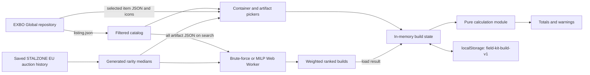

# Architecture

## Product boundary

The application supports manual artifact loadouts and theoretical catalog
optimization. A user selects one backpack or container, then either configures
the capacity-derived slots directly or searches catalog combinations
under shared artifact assumptions and weighted objectives. Armor, consumable
buffs, accounts, remote build storage, owned-artifact inventory, and comparisons
remain outside the implemented product boundary.

The application is a React single-page app built by Vite. The active entry point
is [`src/main.tsx`](../src/main.tsx), and
[`src/App.tsx`](../src/App.tsx) owns the screen flow and application state.

## Runtime flow

At startup, [`loadCatalog`](../src/data.ts) fetches the Global
`listing.json`, keeps base artifact entries plus `containers` and `backpacks`,
and sorts them by English name. Manual item JSON is fetched after selection; the
first optimizer run loads every artifact JSON with up to ten concurrent requests
and retains parsed data in memory for later searches. Images use the icon paths
from the same listing. Both data and images are requested directly from
`raw.githubusercontent.com`; runtime use therefore requires the browser to reach
GitHub.

Pricing is not fetched at runtime. [`src/pricing.ts`](../src/pricing.ts) reads a
compact generated index derived from the checked-in EU auction-history snapshot.
The picker, configured slots, and ranked optimizer builds display the median
completed-sale price for the artifact's selected rarity. A missing tier remains
unknown rather than falling back to another rarity.

## Source ownership

- [`src/data.ts`](../src/data.ts) is the EXBO adapter. It owns repository URLs,
  catalog filtering, recursive numeric/range extraction, translation fallback,
  and conversion from raw item data to calculator stats and container fields.
- [`src/types.ts`](../src/types.ts) defines the boundary between raw EXBO data,
  configured artifacts, persisted builds, and calculated totals.
- [`src/calculations.ts`](../src/calculations.ts) is the pure domain layer. UI or
  optimizer work should call this layer instead of duplicating formulas.
- [`src/optimizer.ts`](../src/optimizer.ts) owns canonical-combination counts,
  exact enumeration, feasible-range discovery, and top-ten weighted ranking.
- [`src/optimizer.worker.ts`](../src/optimizer.worker.ts) runs that synchronous
  search away from the UI thread and reports progress and results.
- [`src/milp-optimizer.ts`](../src/milp-optimizer.ts) expresses the same artifact
  choices and constraints as a mixed-integer linear program, derives objective
  ranges, and returns up to ten proven ranked builds. [`src/milp-optimizer.worker.ts`](../src/milp-optimizer.worker.ts)
  loads the HiGHS WebAssembly solver away from the UI thread.
- [`src/pricing.ts`](../src/pricing.ts) maps EXBO artifact IDs and rarity indices
  to bundled market estimates and owns ruble display formatting. Its generated
  index is authoritative at runtime; raw histories remain source inputs.
- [`src/App.tsx`](../src/App.tsx) owns item selection, slot management, artifact
  editing, optimizer controls and live-data loading, result application, error
  presentation, persistence, and responsive screen composition.
- [`src/styles.css`](../src/styles.css) owns visual layout and the desktop,
  tablet, mobile, and reduced-motion presentation.

## EXBO contract

Only the Global realm is loaded. Item IDs and listing paths are treated as opaque
EXBO values. Stat identity comes from translation keys beginning with
`stalker.artefact_properties.factor.` rather than displayed names. Green/red
`formatted.valueColor` values classify a raw stat as beneficial or harmful, and
the English formatted value determines whether the UI appends `%`. These are
adapter assumptions: changes in EXBO's JSON structure should be handled and
tested in [`src/data.ts`](../src/data.ts), not scattered through the UI.

The project does not redistribute EXBO item files. Attribution and the upstream
license notice are recorded in [`NOTICE`](../NOTICE) and
[`LICENSE`](../LICENSE).

## State and persistence

The selected container and configured artifact array are held in React state.
Changing to a smaller container truncates artifacts beyond its capacity. Copying
an artifact targets the first empty slot. Decreasing artifact level removes bonus
entries beyond the new `+5`, `+10`, and `+15` unlock count.

Every container or artifact change writes a versioned `PersistedBuild` to
`localStorage` under `field-kit-build-v1`. Startup accepts only persistence
version `1`; invalid JSON or other versions are ignored. The saved record includes
the selected raw item data and parsed stats, allowing an existing build to render
when catalog loading fails. Reset clears both state and the storage key.

Generated UI IDs prefer `crypto.randomUUID()` and fall back to a timestamp plus
`Math.random()` when that Web Crypto helper is unavailable. These IDs only
identify local artifact and bonus rows; they are not credentials or security
tokens.

## Failure and privacy boundaries

Catalog-loading errors and selected-item errors are separate UI states. A catalog
failure disables new selection but does not delete a saved build. A selected-item
failure names the item and surfaces the underlying exception. There is no retry,
offline catalog cache, schema validator, or upstream-version pin at present.

No build data is sent to an application backend. Build configuration stays in
the user's browser, while normal HTTP request metadata is visible to GitHub when
the browser loads EXBO JSON and icons. The code contains no runtime secrets.
The bundled auction snapshot is historical EU market data, so estimates can be
stale and are not active-lot quotes or guarantees.

## Optimizer boundary

The optimizer is a theoretical catalog search: every artifact receives one fixed
quality, level, and boundary rarity, and random additional properties are
excluded. It fills every carrier slot, optionally allows duplicate artifact
types, exposes every supported positive stat and harmful exposure without
add/remove controls, and applies independent numerical requirements before
ranking. Positive rows can participate in scoring, require a minimum artifact
contribution, or do both. Each harmful-exposure row can be unrestricted,
game-safe, fully countered, or limited to a custom final value.

The user chooses one of two exact engines. Brute force enumerates canonical
combinations without slot permutations, returns the ten best builds, and rejects
searches above ten million combinations. MILP uses integer counts per artifact,
repeatedly excludes each selected count vector to prove the next-best build
without enumeration, and therefore supports larger carriers. Its displayed
combination count describes the theoretical search space; MILP does not claim an
evaluated or feasible-combination count.

An optional maximum-total-price constraint uses the median estimate for the
optimizer's shared rarity. When enabled, combinations containing an unknown
price or exceeding the cap are infeasible. This filtering happens before
objective ranges and rankings are derived, so normalization reflects the
affordable search space.

Optimizer settings and results are transient. Loading a ranked result clones its
artifacts into the persisted manual build, where individual values can be edited.
Artifact files that fail to load are excluded and counted in the result summary,
so a partially available upstream catalog cannot be mistaken for a complete
search.
